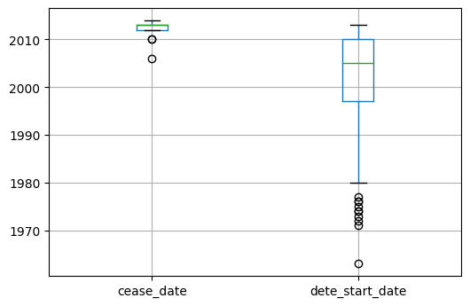
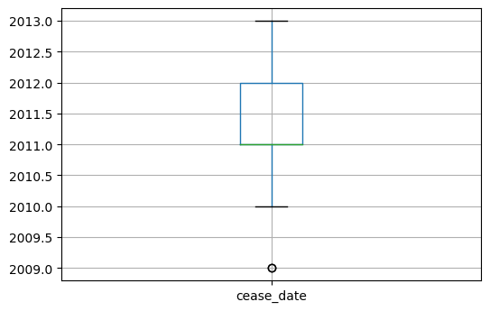
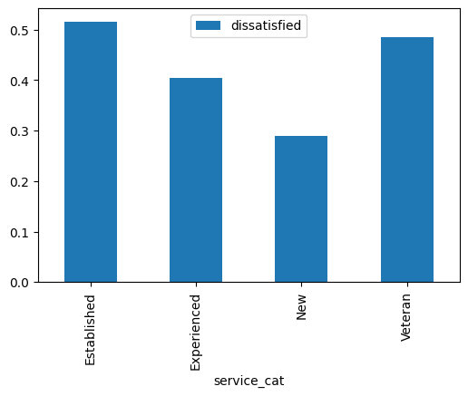

<h1>Clean and Analyze Employee Exit Surveys</h1>

This project will analyze two datasets about employmee survey from DETE and TAFE. 

In this project, we'll play the role of data analyst and pretend our stakeholder want to know the following:
<li> Are employees who only worked for the institutes for a short period of time resigning due to some kind of dissatisfaction? What about employees who have been there longer? </li>
<li> Are younger employees resigning due to some kind of dissatisfaction? What about older employees?</li>


```python
import pandas as pd
import numpy as np
import matplotlib.pyplot as plt
%matplotlib inline
dete_survey = pd.read_csv('dete_survey.csv')
tafe_survey = pd.read_csv('tafe_survey.csv')
```


```python
dete_survey.info()
```

    <class 'pandas.core.frame.DataFrame'>
    RangeIndex: 822 entries, 0 to 821
    Data columns (total 56 columns):
     #   Column                               Non-Null Count  Dtype 
    ---  ------                               --------------  ----- 
     0   ID                                   822 non-null    int64 
     1   SeparationType                       822 non-null    object
     2   Cease Date                           822 non-null    object
     3   DETE Start Date                      822 non-null    object
     4   Role Start Date                      822 non-null    object
     5   Position                             817 non-null    object
     6   Classification                       455 non-null    object
     7   Region                               822 non-null    object
     8   Business Unit                        126 non-null    object
     9   Employment Status                    817 non-null    object
     10  Career move to public sector         822 non-null    bool  
     11  Career move to private sector        822 non-null    bool  
     12  Interpersonal conflicts              822 non-null    bool  
     13  Job dissatisfaction                  822 non-null    bool  
     14  Dissatisfaction with the department  822 non-null    bool  
     15  Physical work environment            822 non-null    bool  
     16  Lack of recognition                  822 non-null    bool  
     17  Lack of job security                 822 non-null    bool  
     18  Work location                        822 non-null    bool  
     19  Employment conditions                822 non-null    bool  
     20  Maternity/family                     822 non-null    bool  
     21  Relocation                           822 non-null    bool  
     22  Study/Travel                         822 non-null    bool  
     23  Ill Health                           822 non-null    bool  
     24  Traumatic incident                   822 non-null    bool  
     25  Work life balance                    822 non-null    bool  
     26  Workload                             822 non-null    bool  
     27  None of the above                    822 non-null    bool  
     28  Professional Development             808 non-null    object
     29  Opportunities for promotion          735 non-null    object
     30  Staff morale                         816 non-null    object
     31  Workplace issue                      788 non-null    object
     32  Physical environment                 817 non-null    object
     33  Worklife balance                     815 non-null    object
     34  Stress and pressure support          810 non-null    object
     35  Performance of supervisor            813 non-null    object
     36  Peer support                         812 non-null    object
     37  Initiative                           813 non-null    object
     38  Skills                               811 non-null    object
     39  Coach                                767 non-null    object
     40  Career Aspirations                   746 non-null    object
     41  Feedback                             792 non-null    object
     42  Further PD                           768 non-null    object
     43  Communication                        814 non-null    object
     44  My say                               812 non-null    object
     45  Information                          816 non-null    object
     46  Kept informed                        813 non-null    object
     47  Wellness programs                    766 non-null    object
     48  Health & Safety                      793 non-null    object
     49  Gender                               798 non-null    object
     50  Age                                  811 non-null    object
     51  Aboriginal                           16 non-null     object
     52  Torres Strait                        3 non-null      object
     53  South Sea                            7 non-null      object
     54  Disability                           23 non-null     object
     55  NESB                                 32 non-null     object
    dtypes: bool(18), int64(1), object(37)
    memory usage: 258.6+ KB


```python
dete_survey.head()
```


<div>
<style scoped>
    .dataframe tbody tr th:only-of-type {
        vertical-align: middle;
    }

    .dataframe tbody tr th {
        vertical-align: top;
    }

    .dataframe thead th {
        text-align: right;
    }
</style>
<table border="1" class="dataframe">
  <thead>
    <tr style="text-align: right;">
      <th></th>
      <th>ID</th>
      <th>SeparationType</th>
      <th>Cease Date</th>
      <th>DETE Start Date</th>
      <th>Role Start Date</th>
      <th>Position</th>
      <th>Classification</th>
      <th>Region</th>
      <th>Business Unit</th>
      <th>Employment Status</th>
      <th>...</th>
      <th>Kept informed</th>
      <th>Wellness programs</th>
      <th>Health &amp; Safety</th>
      <th>Gender</th>
      <th>Age</th>
      <th>Aboriginal</th>
      <th>Torres Strait</th>
      <th>South Sea</th>
      <th>Disability</th>
      <th>NESB</th>
    </tr>
  </thead>
  <tbody>
    <tr>
      <th>0</th>
      <td>1</td>
      <td>Ill Health Retirement</td>
      <td>08/2012</td>
      <td>1984</td>
      <td>2004</td>
      <td>Public Servant</td>
      <td>A01-A04</td>
      <td>Central Office</td>
      <td>Corporate Strategy and Peformance</td>
      <td>Permanent Full-time</td>
      <td>...</td>
      <td>N</td>
      <td>N</td>
      <td>N</td>
      <td>Male</td>
      <td>56-60</td>
      <td>NaN</td>
      <td>NaN</td>
      <td>NaN</td>
      <td>NaN</td>
      <td>Yes</td>
    </tr>
    <tr>
      <th>1</th>
      <td>2</td>
      <td>Voluntary Early Retirement (VER)</td>
      <td>08/2012</td>
      <td>Not Stated</td>
      <td>Not Stated</td>
      <td>Public Servant</td>
      <td>AO5-AO7</td>
      <td>Central Office</td>
      <td>Corporate Strategy and Peformance</td>
      <td>Permanent Full-time</td>
      <td>...</td>
      <td>N</td>
      <td>N</td>
      <td>N</td>
      <td>Male</td>
      <td>56-60</td>
      <td>NaN</td>
      <td>NaN</td>
      <td>NaN</td>
      <td>NaN</td>
      <td>NaN</td>
    </tr>
    <tr>
      <th>2</th>
      <td>3</td>
      <td>Voluntary Early Retirement (VER)</td>
      <td>05/2012</td>
      <td>2011</td>
      <td>2011</td>
      <td>Schools Officer</td>
      <td>NaN</td>
      <td>Central Office</td>
      <td>Education Queensland</td>
      <td>Permanent Full-time</td>
      <td>...</td>
      <td>N</td>
      <td>N</td>
      <td>N</td>
      <td>Male</td>
      <td>61 or older</td>
      <td>NaN</td>
      <td>NaN</td>
      <td>NaN</td>
      <td>NaN</td>
      <td>NaN</td>
    </tr>
    <tr>
      <th>3</th>
      <td>4</td>
      <td>Resignation-Other reasons</td>
      <td>05/2012</td>
      <td>2005</td>
      <td>2006</td>
      <td>Teacher</td>
      <td>Primary</td>
      <td>Central Queensland</td>
      <td>NaN</td>
      <td>Permanent Full-time</td>
      <td>...</td>
      <td>A</td>
      <td>N</td>
      <td>A</td>
      <td>Female</td>
      <td>36-40</td>
      <td>NaN</td>
      <td>NaN</td>
      <td>NaN</td>
      <td>NaN</td>
      <td>NaN</td>
    </tr>
    <tr>
      <th>4</th>
      <td>5</td>
      <td>Age Retirement</td>
      <td>05/2012</td>
      <td>1970</td>
      <td>1989</td>
      <td>Head of Curriculum/Head of Special Education</td>
      <td>NaN</td>
      <td>South East</td>
      <td>NaN</td>
      <td>Permanent Full-time</td>
      <td>...</td>
      <td>N</td>
      <td>A</td>
      <td>M</td>
      <td>Female</td>
      <td>61 or older</td>
      <td>NaN</td>
      <td>NaN</td>
      <td>NaN</td>
      <td>NaN</td>
      <td>NaN</td>
    </tr>
  </tbody>
</table>
<p>5 rows × 56 columns</p>
</div>


```python
tafe_survey.info()
```

    <class 'pandas.core.frame.DataFrame'>
    RangeIndex: 702 entries, 0 to 701
    Data columns (total 72 columns):
     #   Column                                                                                                                                                         Non-Null Count  Dtype  
    ---  ------                                                                                                                                                         --------------  -----  
     0   Record ID                                                                                                                                                      702 non-null    float64
     1   Institute                                                                                                                                                      702 non-null    object 
     2   WorkArea                                                                                                                                                       702 non-null    object 
     3   CESSATION YEAR                                                                                                                                                 695 non-null    float64
     4   Reason for ceasing employment                                                                                                                                  701 non-null    object 
     5   Contributing Factors. Career Move - Public Sector                                                                                                              437 non-null    object 
     6   Contributing Factors. Career Move - Private Sector                                                                                                             437 non-null    object 
     7   Contributing Factors. Career Move - Self-employment                                                                                                            437 non-null    object 
     8   Contributing Factors. Ill Health                                                                                                                               437 non-null    object 
     9   Contributing Factors. Maternity/Family                                                                                                                         437 non-null    object 
     10  Contributing Factors. Dissatisfaction                                                                                                                          437 non-null    object 
     11  Contributing Factors. Job Dissatisfaction                                                                                                                      437 non-null    object 
     12  Contributing Factors. Interpersonal Conflict                                                                                                                   437 non-null    object 
     13  Contributing Factors. Study                                                                                                                                    437 non-null    object 
     14  Contributing Factors. Travel                                                                                                                                   437 non-null    object 
     15  Contributing Factors. Other                                                                                                                                    437 non-null    object 
     16  Contributing Factors. NONE                                                                                                                                     437 non-null    object 
     17  Main Factor. Which of these was the main factor for leaving?                                                                                                   113 non-null    object 
     18  InstituteViews. Topic:1. I feel the senior leadership had a clear vision and direction                                                                         608 non-null    object 
     19  InstituteViews. Topic:2. I was given access to skills training to help me do my job better                                                                     613 non-null    object 
     20  InstituteViews. Topic:3. I was given adequate opportunities for personal development                                                                           610 non-null    object 
     21  InstituteViews. Topic:4. I was given adequate opportunities for promotion within %Institute]Q25LBL%                                                            608 non-null    object 
     22  InstituteViews. Topic:5. I felt the salary for the job was right for the responsibilities I had                                                                615 non-null    object 
     23  InstituteViews. Topic:6. The organisation recognised when staff did good work                                                                                  607 non-null    object 
     24  InstituteViews. Topic:7. Management was generally supportive of me                                                                                             614 non-null    object 
     25  InstituteViews. Topic:8. Management was generally supportive of my team                                                                                        608 non-null    object 
     26  InstituteViews. Topic:9. I was kept informed of the changes in the organisation which would affect me                                                          610 non-null    object 
     27  InstituteViews. Topic:10. Staff morale was positive within the Institute                                                                                       602 non-null    object 
     28  InstituteViews. Topic:11. If I had a workplace issue it was dealt with quickly                                                                                 601 non-null    object 
     29  InstituteViews. Topic:12. If I had a workplace issue it was dealt with efficiently                                                                             597 non-null    object 
     30  InstituteViews. Topic:13. If I had a workplace issue it was dealt with discreetly                                                                              601 non-null    object 
     31  WorkUnitViews. Topic:14. I was satisfied with the quality of the management and supervision within my work unit                                                609 non-null    object 
     32  WorkUnitViews. Topic:15. I worked well with my colleagues                                                                                                      605 non-null    object 
     33  WorkUnitViews. Topic:16. My job was challenging and interesting                                                                                                607 non-null    object 
     34  WorkUnitViews. Topic:17. I was encouraged to use my initiative in the course of my work                                                                        610 non-null    object 
     35  WorkUnitViews. Topic:18. I had sufficient contact with other people in my job                                                                                  613 non-null    object 
     36  WorkUnitViews. Topic:19. I was given adequate support and co-operation by my peers to enable me to do my job                                                   609 non-null    object 
     37  WorkUnitViews. Topic:20. I was able to use the full range of my skills in my job                                                                               609 non-null    object 
     38  WorkUnitViews. Topic:21. I was able to use the full range of my abilities in my job. ; Category:Level of Agreement; Question:YOUR VIEWS ABOUT YOUR WORK UNIT]  608 non-null    object 
     39  WorkUnitViews. Topic:22. I was able to use the full range of my knowledge in my job                                                                            608 non-null    object 
     40  WorkUnitViews. Topic:23. My job provided sufficient variety                                                                                                    611 non-null    object 
     41  WorkUnitViews. Topic:24. I was able to cope with the level of stress and pressure in my job                                                                    610 non-null    object 
     42  WorkUnitViews. Topic:25. My job allowed me to balance the demands of work and family to my satisfaction                                                        611 non-null    object 
     43  WorkUnitViews. Topic:26. My supervisor gave me adequate personal recognition and feedback on my performance                                                    606 non-null    object 
     44  WorkUnitViews. Topic:27. My working environment was satisfactory e.g. sufficient space, good lighting, suitable seating and working area                       610 non-null    object 
     45  WorkUnitViews. Topic:28. I was given the opportunity to mentor and coach others in order for me to pass on my skills and knowledge prior to my cessation date  609 non-null    object 
     46  WorkUnitViews. Topic:29. There was adequate communication between staff in my unit                                                                             603 non-null    object 
     47  WorkUnitViews. Topic:30. Staff morale was positive within my work unit                                                                                         606 non-null    object 
     48  Induction. Did you undertake Workplace Induction?                                                                                                              619 non-null    object 
     49  InductionInfo. Topic:Did you undertake a Corporate Induction?                                                                                                  432 non-null    object 
     50  InductionInfo. Topic:Did you undertake a Institute Induction?                                                                                                  483 non-null    object 
     51  InductionInfo. Topic: Did you undertake Team Induction?                                                                                                        440 non-null    object 
     52  InductionInfo. Face to Face Topic:Did you undertake a Corporate Induction; Category:How it was conducted?                                                      555 non-null    object 
     53  InductionInfo. On-line Topic:Did you undertake a Corporate Induction; Category:How it was conducted?                                                           555 non-null    object 
     54  InductionInfo. Induction Manual Topic:Did you undertake a Corporate Induction?                                                                                 555 non-null    object 
     55  InductionInfo. Face to Face Topic:Did you undertake a Institute Induction?                                                                                     530 non-null    object 
     56  InductionInfo. On-line Topic:Did you undertake a Institute Induction?                                                                                          555 non-null    object 
     57  InductionInfo. Induction Manual Topic:Did you undertake a Institute Induction?                                                                                 553 non-null    object 
     58  InductionInfo. Face to Face Topic: Did you undertake Team Induction; Category?                                                                                 555 non-null    object 
     59  InductionInfo. On-line Topic: Did you undertake Team Induction?process you undertook and how it was conducted.]                                                555 non-null    object 
     60  InductionInfo. Induction Manual Topic: Did you undertake Team Induction?                                                                                       555 non-null    object 
     61  Workplace. Topic:Did you and your Manager develop a Performance and Professional Development Plan (PPDP)?                                                      608 non-null    object 
     62  Workplace. Topic:Does your workplace promote a work culture free from all forms of unlawful discrimination?                                                    594 non-null    object 
     63  Workplace. Topic:Does your workplace promote and practice the principles of employment equity?                                                                 587 non-null    object 
     64  Workplace. Topic:Does your workplace value the diversity of its employees?                                                                                     586 non-null    object 
     65  Workplace. Topic:Would you recommend the Institute as an employer to others?                                                                                   581 non-null    object 
     66  Gender. What is your Gender?                                                                                                                                   596 non-null    object 
     67  CurrentAge. Current Age                                                                                                                                        596 non-null    object 
     68  Employment Type. Employment Type                                                                                                                               596 non-null    object 
     69  Classification. Classification                                                                                                                                 596 non-null    object 
     70  LengthofServiceOverall. Overall Length of Service at Institute (in years)                                                                                      596 non-null    object 
     71  LengthofServiceCurrent. Length of Service at current workplace (in years)                                                                                      596 non-null    object 
    dtypes: float64(2), object(70)
    memory usage: 395.0+ KB


```python
tafe_survey.head()
```


<div>
<style scoped>
    .dataframe tbody tr th:only-of-type {
        vertical-align: middle;
    }

    .dataframe tbody tr th {
        vertical-align: top;
    }

    .dataframe thead th {
        text-align: right;
    }
</style>
<table border="1" class="dataframe">
  <thead>
    <tr style="text-align: right;">
      <th></th>
      <th>Record ID</th>
      <th>Institute</th>
      <th>WorkArea</th>
      <th>CESSATION YEAR</th>
      <th>Reason for ceasing employment</th>
      <th>Contributing Factors. Career Move - Public Sector</th>
      <th>Contributing Factors. Career Move - Private Sector</th>
      <th>Contributing Factors. Career Move - Self-employment</th>
      <th>Contributing Factors. Ill Health</th>
      <th>Contributing Factors. Maternity/Family</th>
      <th>...</th>
      <th>Workplace. Topic:Does your workplace promote a work culture free from all forms of unlawful discrimination?</th>
      <th>Workplace. Topic:Does your workplace promote and practice the principles of employment equity?</th>
      <th>Workplace. Topic:Does your workplace value the diversity of its employees?</th>
      <th>Workplace. Topic:Would you recommend the Institute as an employer to others?</th>
      <th>Gender. What is your Gender?</th>
      <th>CurrentAge. Current Age</th>
      <th>Employment Type. Employment Type</th>
      <th>Classification. Classification</th>
      <th>LengthofServiceOverall. Overall Length of Service at Institute (in years)</th>
      <th>LengthofServiceCurrent. Length of Service at current workplace (in years)</th>
    </tr>
  </thead>
  <tbody>
    <tr>
      <th>0</th>
      <td>6.341330e+17</td>
      <td>Southern Queensland Institute of TAFE</td>
      <td>Non-Delivery (corporate)</td>
      <td>2010.0</td>
      <td>Contract Expired</td>
      <td>NaN</td>
      <td>NaN</td>
      <td>NaN</td>
      <td>NaN</td>
      <td>NaN</td>
      <td>...</td>
      <td>Yes</td>
      <td>Yes</td>
      <td>Yes</td>
      <td>Yes</td>
      <td>Female</td>
      <td>26  30</td>
      <td>Temporary Full-time</td>
      <td>Administration (AO)</td>
      <td>1-2</td>
      <td>1-2</td>
    </tr>
    <tr>
      <th>1</th>
      <td>6.341337e+17</td>
      <td>Mount Isa Institute of TAFE</td>
      <td>Non-Delivery (corporate)</td>
      <td>2010.0</td>
      <td>Retirement</td>
      <td>-</td>
      <td>-</td>
      <td>-</td>
      <td>-</td>
      <td>-</td>
      <td>...</td>
      <td>Yes</td>
      <td>Yes</td>
      <td>Yes</td>
      <td>Yes</td>
      <td>NaN</td>
      <td>NaN</td>
      <td>NaN</td>
      <td>NaN</td>
      <td>NaN</td>
      <td>NaN</td>
    </tr>
    <tr>
      <th>2</th>
      <td>6.341388e+17</td>
      <td>Mount Isa Institute of TAFE</td>
      <td>Delivery (teaching)</td>
      <td>2010.0</td>
      <td>Retirement</td>
      <td>-</td>
      <td>-</td>
      <td>-</td>
      <td>-</td>
      <td>-</td>
      <td>...</td>
      <td>Yes</td>
      <td>Yes</td>
      <td>Yes</td>
      <td>Yes</td>
      <td>NaN</td>
      <td>NaN</td>
      <td>NaN</td>
      <td>NaN</td>
      <td>NaN</td>
      <td>NaN</td>
    </tr>
    <tr>
      <th>3</th>
      <td>6.341399e+17</td>
      <td>Mount Isa Institute of TAFE</td>
      <td>Non-Delivery (corporate)</td>
      <td>2010.0</td>
      <td>Resignation</td>
      <td>-</td>
      <td>-</td>
      <td>-</td>
      <td>-</td>
      <td>-</td>
      <td>...</td>
      <td>Yes</td>
      <td>Yes</td>
      <td>Yes</td>
      <td>Yes</td>
      <td>NaN</td>
      <td>NaN</td>
      <td>NaN</td>
      <td>NaN</td>
      <td>NaN</td>
      <td>NaN</td>
    </tr>
    <tr>
      <th>4</th>
      <td>6.341466e+17</td>
      <td>Southern Queensland Institute of TAFE</td>
      <td>Delivery (teaching)</td>
      <td>2010.0</td>
      <td>Resignation</td>
      <td>-</td>
      <td>Career Move - Private Sector</td>
      <td>-</td>
      <td>-</td>
      <td>-</td>
      <td>...</td>
      <td>Yes</td>
      <td>Yes</td>
      <td>Yes</td>
      <td>Yes</td>
      <td>Male</td>
      <td>41  45</td>
      <td>Permanent Full-time</td>
      <td>Teacher (including LVT)</td>
      <td>3-4</td>
      <td>3-4</td>
    </tr>
  </tbody>
</table>
<p>5 rows × 72 columns</p>
</div>


```python
dete_survey.shape
```


    (822, 56)


Data set DETE zawiera 56 column and 822 rows


```python
dete_survey.isnull().sum()
```


    ID                                       0
    SeparationType                           0
    Cease Date                               0
    DETE Start Date                          0
    Role Start Date                          0
    Position                                 5
    Classification                         367
    Region                                   0
    Business Unit                          696
    Employment Status                        5
    Career move to public sector             0
    Career move to private sector            0
    Interpersonal conflicts                  0
    Job dissatisfaction                      0
    Dissatisfaction with the department      0
    Physical work environment                0
    Lack of recognition                      0
    Lack of job security                     0
    Work location                            0
    Employment conditions                    0
    Maternity/family                         0
    Relocation                               0
    Study/Travel                             0
    Ill Health                               0
    Traumatic incident                       0
    Work life balance                        0
    Workload                                 0
    None of the above                        0
    Professional Development                14
    Opportunities for promotion             87
    Staff morale                             6
    Workplace issue                         34
    Physical environment                     5
    Worklife balance                         7
    Stress and pressure support             12
    Performance of supervisor                9
    Peer support                            10
    Initiative                               9
    Skills                                  11
    Coach                                   55
    Career Aspirations                      76
    Feedback                                30
    Further PD                              54
    Communication                            8
    My say                                  10
    Information                              6
    Kept informed                            9
    Wellness programs                       56
    Health & Safety                         29
    Gender                                  24
    Age                                     11
    Aboriginal                             806
    Torres Strait                          819
    South Sea                              815
    Disability                             799
    NESB                                   790
    dtype: int64


Columns <b>Aboriginal</b>, <b>Torres Strait</b>, <b>South Sea</b>, <b>Disability</b>, <b> NSBE</b> and <b>Business Unit</b> have mostly empty rows. <b>Classfication</b> also have a lot of empty rows 367


```python
dete_survey['SeparationType'].value_counts()
```


    Age Retirement                          285
    Resignation-Other reasons               150
    Resignation-Other employer               91
    Resignation-Move overseas/interstate     70
    Voluntary Early Retirement (VER)         67
    Ill Health Retirement                    61
    Other                                    49
    Contract Expired                         34
    Termination                              15
    Name: SeparationType, dtype: int64


A lot of employees left company due to <b>Age Retirement</b> and <b>Resignation-Other reasons</b>


```python
tafe_survey.shape
```


    (702, 72)


Data set TAFE contains 702 rows and 72 columns


```python
pust = tafe_survey.isnull().sum()
```


```python
print(pust)
```

    Record ID                                                                      0
    Institute                                                                      0
    WorkArea                                                                       0
    CESSATION YEAR                                                                 7
    Reason for ceasing employment                                                  1
                                                                                ... 
    CurrentAge. Current Age                                                      106
    Employment Type. Employment Type                                             106
    Classification. Classification                                               106
    LengthofServiceOverall. Overall Length of Service at Institute (in years)    106
    LengthofServiceCurrent. Length of Service at current workplace (in years)    106
    Length: 72, dtype: int64


```python
tafe_survey['Reason for ceasing employment'].value_counts()
```


    Resignation                 340
    Contract Expired            127
    Retrenchment/ Redundancy    104
    Retirement                   82
    Transfer                     25
    Termination                  23
    Name: Reason for ceasing employment, dtype: int64


People left campany mostly of <b>Resignation</b>, <b>Contract Expired</b>, <b>Retrenchment/ Redundancy</b> and <b>Retirement</b>

Now we will re-read data sets with parameters which will handle NaN values.


```python
dete_survey = pd.read_csv('dete_survey.csv', na_values = 'Not Stated')
```


```python
dete_survey_updated = dete_survey.drop(dete_survey.columns[28:49], axis=1)
```


```python
tafe_survey_updated = tafe_survey.drop(tafe_survey.columns[17:66], axis=1)
```

I prepare new data set's <i>_updated</i> this data sets contains only usefull columns. We use <b>DataFrame.drop()</b> method to drop columns which are not needed for our analysis.


```python
dete_survey_updated.shape
```


    (822, 35)


```python
tafe_survey_updated.shape
```


    (702, 23)


```python
dete_survey_updated.columns = dete_survey_updated.columns.str.lower().str.strip().str.replace(' ', '_')
```


```python
tafe_survey_updated.columns
```


    Index(['Record ID', 'Institute', 'WorkArea', 'CESSATION YEAR',
           'Reason for ceasing employment',
           'Contributing Factors. Career Move - Public Sector ',
           'Contributing Factors. Career Move - Private Sector ',
           'Contributing Factors. Career Move - Self-employment',
           'Contributing Factors. Ill Health',
           'Contributing Factors. Maternity/Family',
           'Contributing Factors. Dissatisfaction',
           'Contributing Factors. Job Dissatisfaction',
           'Contributing Factors. Interpersonal Conflict',
           'Contributing Factors. Study', 'Contributing Factors. Travel',
           'Contributing Factors. Other', 'Contributing Factors. NONE',
           'Gender. What is your Gender?', 'CurrentAge. Current Age',
           'Employment Type. Employment Type', 'Classification. Classification',
           'LengthofServiceOverall. Overall Length of Service at Institute (in years)',
           'LengthofServiceCurrent. Length of Service at current workplace (in years)'],
          dtype='object')


```python
columns_new = {'Record ID': 'id', 'CESSATION YEAR': 'cease_date', 'Reason for ceasing employment': 'separationtype',
              'Gender. What is your Gender?': 'gender', 'CurrentAge. Current Age': 'age', 
              'Employment Type. Employment Type': 'employment_status', 'Classification. Classification': 'position', 
              'LengthofServiceOverall. Overall Length of Service at Institute (in years)': 'institute_service', 
              'LengthofServiceCurrent. Length of Service at current workplace (in years)': 'role_service'}
tafe_survey_updated = tafe_survey_updated.rename(columns=columns_new)
```


```python
dete_survey_updated.head()
```


<div>
<style scoped>
    .dataframe tbody tr th:only-of-type {
        vertical-align: middle;
    }

    .dataframe tbody tr th {
        vertical-align: top;
    }

    .dataframe thead th {
        text-align: right;
    }
</style>
<table border="1" class="dataframe">
  <thead>
    <tr style="text-align: right;">
      <th></th>
      <th>id</th>
      <th>separationtype</th>
      <th>cease_date</th>
      <th>dete_start_date</th>
      <th>role_start_date</th>
      <th>position</th>
      <th>classification</th>
      <th>region</th>
      <th>business_unit</th>
      <th>employment_status</th>
      <th>...</th>
      <th>work_life_balance</th>
      <th>workload</th>
      <th>none_of_the_above</th>
      <th>gender</th>
      <th>age</th>
      <th>aboriginal</th>
      <th>torres_strait</th>
      <th>south_sea</th>
      <th>disability</th>
      <th>nesb</th>
    </tr>
  </thead>
  <tbody>
    <tr>
      <th>0</th>
      <td>1</td>
      <td>Ill Health Retirement</td>
      <td>08/2012</td>
      <td>1984.0</td>
      <td>2004.0</td>
      <td>Public Servant</td>
      <td>A01-A04</td>
      <td>Central Office</td>
      <td>Corporate Strategy and Peformance</td>
      <td>Permanent Full-time</td>
      <td>...</td>
      <td>False</td>
      <td>False</td>
      <td>True</td>
      <td>Male</td>
      <td>56-60</td>
      <td>NaN</td>
      <td>NaN</td>
      <td>NaN</td>
      <td>NaN</td>
      <td>Yes</td>
    </tr>
    <tr>
      <th>1</th>
      <td>2</td>
      <td>Voluntary Early Retirement (VER)</td>
      <td>08/2012</td>
      <td>NaN</td>
      <td>NaN</td>
      <td>Public Servant</td>
      <td>AO5-AO7</td>
      <td>Central Office</td>
      <td>Corporate Strategy and Peformance</td>
      <td>Permanent Full-time</td>
      <td>...</td>
      <td>False</td>
      <td>False</td>
      <td>False</td>
      <td>Male</td>
      <td>56-60</td>
      <td>NaN</td>
      <td>NaN</td>
      <td>NaN</td>
      <td>NaN</td>
      <td>NaN</td>
    </tr>
    <tr>
      <th>2</th>
      <td>3</td>
      <td>Voluntary Early Retirement (VER)</td>
      <td>05/2012</td>
      <td>2011.0</td>
      <td>2011.0</td>
      <td>Schools Officer</td>
      <td>NaN</td>
      <td>Central Office</td>
      <td>Education Queensland</td>
      <td>Permanent Full-time</td>
      <td>...</td>
      <td>False</td>
      <td>False</td>
      <td>True</td>
      <td>Male</td>
      <td>61 or older</td>
      <td>NaN</td>
      <td>NaN</td>
      <td>NaN</td>
      <td>NaN</td>
      <td>NaN</td>
    </tr>
    <tr>
      <th>3</th>
      <td>4</td>
      <td>Resignation-Other reasons</td>
      <td>05/2012</td>
      <td>2005.0</td>
      <td>2006.0</td>
      <td>Teacher</td>
      <td>Primary</td>
      <td>Central Queensland</td>
      <td>NaN</td>
      <td>Permanent Full-time</td>
      <td>...</td>
      <td>False</td>
      <td>False</td>
      <td>False</td>
      <td>Female</td>
      <td>36-40</td>
      <td>NaN</td>
      <td>NaN</td>
      <td>NaN</td>
      <td>NaN</td>
      <td>NaN</td>
    </tr>
    <tr>
      <th>4</th>
      <td>5</td>
      <td>Age Retirement</td>
      <td>05/2012</td>
      <td>1970.0</td>
      <td>1989.0</td>
      <td>Head of Curriculum/Head of Special Education</td>
      <td>NaN</td>
      <td>South East</td>
      <td>NaN</td>
      <td>Permanent Full-time</td>
      <td>...</td>
      <td>True</td>
      <td>False</td>
      <td>False</td>
      <td>Female</td>
      <td>61 or older</td>
      <td>NaN</td>
      <td>NaN</td>
      <td>NaN</td>
      <td>NaN</td>
      <td>NaN</td>
    </tr>
  </tbody>
</table>
<p>5 rows × 35 columns</p>
</div>


```python
tafe_survey_updated.head()
```


<div>
<style scoped>
    .dataframe tbody tr th:only-of-type {
        vertical-align: middle;
    }

    .dataframe tbody tr th {
        vertical-align: top;
    }

    .dataframe thead th {
        text-align: right;
    }
</style>
<table border="1" class="dataframe">
  <thead>
    <tr style="text-align: right;">
      <th></th>
      <th>id</th>
      <th>Institute</th>
      <th>WorkArea</th>
      <th>cease_date</th>
      <th>separationtype</th>
      <th>Contributing Factors. Career Move - Public Sector</th>
      <th>Contributing Factors. Career Move - Private Sector</th>
      <th>Contributing Factors. Career Move - Self-employment</th>
      <th>Contributing Factors. Ill Health</th>
      <th>Contributing Factors. Maternity/Family</th>
      <th>...</th>
      <th>Contributing Factors. Study</th>
      <th>Contributing Factors. Travel</th>
      <th>Contributing Factors. Other</th>
      <th>Contributing Factors. NONE</th>
      <th>gender</th>
      <th>age</th>
      <th>employment_status</th>
      <th>position</th>
      <th>institute_service</th>
      <th>role_service</th>
    </tr>
  </thead>
  <tbody>
    <tr>
      <th>0</th>
      <td>6.341330e+17</td>
      <td>Southern Queensland Institute of TAFE</td>
      <td>Non-Delivery (corporate)</td>
      <td>2010.0</td>
      <td>Contract Expired</td>
      <td>NaN</td>
      <td>NaN</td>
      <td>NaN</td>
      <td>NaN</td>
      <td>NaN</td>
      <td>...</td>
      <td>NaN</td>
      <td>NaN</td>
      <td>NaN</td>
      <td>NaN</td>
      <td>Female</td>
      <td>26  30</td>
      <td>Temporary Full-time</td>
      <td>Administration (AO)</td>
      <td>1-2</td>
      <td>1-2</td>
    </tr>
    <tr>
      <th>1</th>
      <td>6.341337e+17</td>
      <td>Mount Isa Institute of TAFE</td>
      <td>Non-Delivery (corporate)</td>
      <td>2010.0</td>
      <td>Retirement</td>
      <td>-</td>
      <td>-</td>
      <td>-</td>
      <td>-</td>
      <td>-</td>
      <td>...</td>
      <td>-</td>
      <td>Travel</td>
      <td>-</td>
      <td>-</td>
      <td>NaN</td>
      <td>NaN</td>
      <td>NaN</td>
      <td>NaN</td>
      <td>NaN</td>
      <td>NaN</td>
    </tr>
    <tr>
      <th>2</th>
      <td>6.341388e+17</td>
      <td>Mount Isa Institute of TAFE</td>
      <td>Delivery (teaching)</td>
      <td>2010.0</td>
      <td>Retirement</td>
      <td>-</td>
      <td>-</td>
      <td>-</td>
      <td>-</td>
      <td>-</td>
      <td>...</td>
      <td>-</td>
      <td>-</td>
      <td>-</td>
      <td>NONE</td>
      <td>NaN</td>
      <td>NaN</td>
      <td>NaN</td>
      <td>NaN</td>
      <td>NaN</td>
      <td>NaN</td>
    </tr>
    <tr>
      <th>3</th>
      <td>6.341399e+17</td>
      <td>Mount Isa Institute of TAFE</td>
      <td>Non-Delivery (corporate)</td>
      <td>2010.0</td>
      <td>Resignation</td>
      <td>-</td>
      <td>-</td>
      <td>-</td>
      <td>-</td>
      <td>-</td>
      <td>...</td>
      <td>-</td>
      <td>Travel</td>
      <td>-</td>
      <td>-</td>
      <td>NaN</td>
      <td>NaN</td>
      <td>NaN</td>
      <td>NaN</td>
      <td>NaN</td>
      <td>NaN</td>
    </tr>
    <tr>
      <th>4</th>
      <td>6.341466e+17</td>
      <td>Southern Queensland Institute of TAFE</td>
      <td>Delivery (teaching)</td>
      <td>2010.0</td>
      <td>Resignation</td>
      <td>-</td>
      <td>Career Move - Private Sector</td>
      <td>-</td>
      <td>-</td>
      <td>-</td>
      <td>...</td>
      <td>-</td>
      <td>-</td>
      <td>-</td>
      <td>-</td>
      <td>Male</td>
      <td>41  45</td>
      <td>Permanent Full-time</td>
      <td>Teacher (including LVT)</td>
      <td>3-4</td>
      <td>3-4</td>
    </tr>
  </tbody>
</table>
<p>5 rows × 23 columns</p>
</div>


I prepare new Date Frames <b>dete_survey_updated</b> and <b>tafe_survey_updated</b>. I changed column names, all important columns have lower letters and space is replaced by underscore.


```python
dete_survey_updated['separationtype'].value_counts()
```


    Age Retirement                          285
    Resignation-Other reasons               150
    Resignation-Other employer               91
    Resignation-Move overseas/interstate     70
    Voluntary Early Retirement (VER)         67
    Ill Health Retirement                    61
    Other                                    49
    Contract Expired                         34
    Termination                              15
    Name: separationtype, dtype: int64


```python
tafe_survey_updated['separationtype'].value_counts()
```


    Resignation                 340
    Contract Expired            127
    Retrenchment/ Redundancy    104
    Retirement                   82
    Transfer                     25
    Termination                  23
    Name: separationtype, dtype: int64


```python
dete_resignations = dete_survey_updated[dete_survey_updated['separationtype'].str.contains('Resignation')].copy()
```


```python
tafe_resignations = tafe_survey_updated[tafe_survey_updated['separationtype'].str.contains('Resignation', na=True)].copy()
```


```python
tafe_resignations.head()
```


<div>
<style scoped>
    .dataframe tbody tr th:only-of-type {
        vertical-align: middle;
    }

    .dataframe tbody tr th {
        vertical-align: top;
    }

    .dataframe thead th {
        text-align: right;
    }
</style>
<table border="1" class="dataframe">
  <thead>
    <tr style="text-align: right;">
      <th></th>
      <th>id</th>
      <th>Institute</th>
      <th>WorkArea</th>
      <th>cease_date</th>
      <th>separationtype</th>
      <th>Contributing Factors. Career Move - Public Sector</th>
      <th>Contributing Factors. Career Move - Private Sector</th>
      <th>Contributing Factors. Career Move - Self-employment</th>
      <th>Contributing Factors. Ill Health</th>
      <th>Contributing Factors. Maternity/Family</th>
      <th>...</th>
      <th>Contributing Factors. Study</th>
      <th>Contributing Factors. Travel</th>
      <th>Contributing Factors. Other</th>
      <th>Contributing Factors. NONE</th>
      <th>gender</th>
      <th>age</th>
      <th>employment_status</th>
      <th>position</th>
      <th>institute_service</th>
      <th>role_service</th>
    </tr>
  </thead>
  <tbody>
    <tr>
      <th>3</th>
      <td>6.341399e+17</td>
      <td>Mount Isa Institute of TAFE</td>
      <td>Non-Delivery (corporate)</td>
      <td>2010.0</td>
      <td>Resignation</td>
      <td>-</td>
      <td>-</td>
      <td>-</td>
      <td>-</td>
      <td>-</td>
      <td>...</td>
      <td>-</td>
      <td>Travel</td>
      <td>-</td>
      <td>-</td>
      <td>NaN</td>
      <td>NaN</td>
      <td>NaN</td>
      <td>NaN</td>
      <td>NaN</td>
      <td>NaN</td>
    </tr>
    <tr>
      <th>4</th>
      <td>6.341466e+17</td>
      <td>Southern Queensland Institute of TAFE</td>
      <td>Delivery (teaching)</td>
      <td>2010.0</td>
      <td>Resignation</td>
      <td>-</td>
      <td>Career Move - Private Sector</td>
      <td>-</td>
      <td>-</td>
      <td>-</td>
      <td>...</td>
      <td>-</td>
      <td>-</td>
      <td>-</td>
      <td>-</td>
      <td>Male</td>
      <td>41  45</td>
      <td>Permanent Full-time</td>
      <td>Teacher (including LVT)</td>
      <td>3-4</td>
      <td>3-4</td>
    </tr>
    <tr>
      <th>5</th>
      <td>6.341475e+17</td>
      <td>Southern Queensland Institute of TAFE</td>
      <td>Delivery (teaching)</td>
      <td>2010.0</td>
      <td>Resignation</td>
      <td>-</td>
      <td>-</td>
      <td>-</td>
      <td>-</td>
      <td>-</td>
      <td>...</td>
      <td>-</td>
      <td>-</td>
      <td>Other</td>
      <td>-</td>
      <td>Female</td>
      <td>56 or older</td>
      <td>Contract/casual</td>
      <td>Teacher (including LVT)</td>
      <td>7-10</td>
      <td>7-10</td>
    </tr>
    <tr>
      <th>6</th>
      <td>6.341520e+17</td>
      <td>Barrier Reef Institute of TAFE</td>
      <td>Non-Delivery (corporate)</td>
      <td>2010.0</td>
      <td>Resignation</td>
      <td>-</td>
      <td>Career Move - Private Sector</td>
      <td>-</td>
      <td>-</td>
      <td>Maternity/Family</td>
      <td>...</td>
      <td>-</td>
      <td>-</td>
      <td>Other</td>
      <td>-</td>
      <td>Male</td>
      <td>20 or younger</td>
      <td>Temporary Full-time</td>
      <td>Administration (AO)</td>
      <td>3-4</td>
      <td>3-4</td>
    </tr>
    <tr>
      <th>7</th>
      <td>6.341537e+17</td>
      <td>Southern Queensland Institute of TAFE</td>
      <td>Delivery (teaching)</td>
      <td>2010.0</td>
      <td>Resignation</td>
      <td>-</td>
      <td>-</td>
      <td>-</td>
      <td>-</td>
      <td>-</td>
      <td>...</td>
      <td>-</td>
      <td>-</td>
      <td>Other</td>
      <td>-</td>
      <td>Male</td>
      <td>46  50</td>
      <td>Permanent Full-time</td>
      <td>Teacher (including LVT)</td>
      <td>3-4</td>
      <td>3-4</td>
    </tr>
  </tbody>
</table>
<p>5 rows × 23 columns</p>
</div>


Our analysis will be made only on separationtype which contain string <b>Resignation</b>. I prepared next new data sets wich contain only this data. 


```python
dete_resignations['cease_date'] = dete_resignations['cease_date'].str.replace('([0-9]{2}/)', '')
```


```python
dete_resignations['cease_date'] = dete_resignations['cease_date'].astype('float')
```


```python
dete_resignations['cease_date'].value_counts()
```


    2013.0    146
    2012.0    129
    2014.0     22
    2010.0      2
    2006.0      1
    Name: cease_date, dtype: int64


```python
dete_resignations['dete_start_date'].value_counts()
```


    2011.0    24
    2008.0    22
    2007.0    21
    2012.0    21
    2010.0    17
    2005.0    15
    2004.0    14
    2009.0    13
    2006.0    13
    2013.0    10
    2000.0     9
    1999.0     8
    1996.0     6
    2002.0     6
    1992.0     6
    1998.0     6
    2003.0     6
    1994.0     6
    1993.0     5
    1990.0     5
    1980.0     5
    1997.0     5
    1991.0     4
    1989.0     4
    1988.0     4
    1995.0     4
    2001.0     3
    1985.0     3
    1986.0     3
    1983.0     2
    1976.0     2
    1974.0     2
    1971.0     1
    1972.0     1
    1984.0     1
    1982.0     1
    1987.0     1
    1975.0     1
    1973.0     1
    1977.0     1
    1963.0     1
    Name: dete_start_date, dtype: int64


```python
tafe_resignations['cease_date'].value_counts()
```


    2011.0    117
    2012.0     94
    2010.0     68
    2013.0     55
    2009.0      2
    Name: cease_date, dtype: int64


```python
dete_resignations.boxplot(column=['cease_date', 'dete_start_date'])
plt.show()
```


    

    


```python
tafe_resignations.boxplot(column='cease_date')
plt.show()
```


    

    


In this part <i>date columns</i> was cleaned. I left only values related to year and changed type of data in columns as float.


```python
dete_resignations['institute_service'] = dete_resignations['cease_date'] - dete_resignations['dete_start_date']
```

In this step create new column <b>institute_service</b> which contains information how long employees work in institute. This data give us answer for our question.


```python
tafe_survey_updated['Contributing Factors. Dissatisfaction'].isnull().sum()
```


    265


```python
tafe_resignations['Contributing Factors. Dissatisfaction'].value_counts()
```


    -                                         277
    Contributing Factors. Dissatisfaction      55
    Name: Contributing Factors. Dissatisfaction, dtype: int64


```python
tafe_resignations['Contributing Factors. Job Dissatisfaction'].value_counts()
```


    -                      270
    Job Dissatisfaction     62
    Name: Contributing Factors. Job Dissatisfaction, dtype: int64


We write function which will be update columns with values True, False or NaN dependend of orginal value.


```python
def update_vals(wartosc):
    if pd.isnull(wartosc):
        return np.nan
    elif wartosc == '-':
        return False
    else:
        return True
```


```python
kolumny = ['Contributing Factors. Dissatisfaction', 'Contributing Factors. Job Dissatisfaction']
tafe_resignations[kolumny] = tafe_resignations[kolumny].applymap(update_vals)
```


```python
tafe_resignations['dissatisfied'] = tafe_resignations[kolumny].any(axis=1, skipna=False)
```


```python
tafe_resignations['dissatisfied'].value_counts()
```


    False    241
    True      91
    Name: dissatisfied, dtype: int64


```python
dete_kolumny = ['job_dissatisfaction', 'dissatisfaction_with_the_department',
               'physical_work_environment', 'lack_of_recognition', 'lack_of_job_security',
               'work_location', 'employment_conditions', 'work_life_balance', 'workload']
dete_resignations['dissatisfied'] = dete_resignations[dete_kolumny].any(axis=1, skipna=False)
```


```python
dete_resignations['dissatisfied'].value_counts()
```


    False    162
    True     149
    Name: dissatisfied, dtype: int64


```python
dete_resignations_up = dete_resignations.copy()
```


```python
tafe_resignations_up = tafe_resignations.copy()
```


```python
dete_resignations_up.head(14)
```


<div>
<style scoped>
    .dataframe tbody tr th:only-of-type {
        vertical-align: middle;
    }

    .dataframe tbody tr th {
        vertical-align: top;
    }

    .dataframe thead th {
        text-align: right;
    }
</style>
<table border="1" class="dataframe">
  <thead>
    <tr style="text-align: right;">
      <th></th>
      <th>id</th>
      <th>separationtype</th>
      <th>cease_date</th>
      <th>dete_start_date</th>
      <th>role_start_date</th>
      <th>position</th>
      <th>classification</th>
      <th>region</th>
      <th>business_unit</th>
      <th>employment_status</th>
      <th>...</th>
      <th>none_of_the_above</th>
      <th>gender</th>
      <th>age</th>
      <th>aboriginal</th>
      <th>torres_strait</th>
      <th>south_sea</th>
      <th>disability</th>
      <th>nesb</th>
      <th>institute_service</th>
      <th>dissatisfied</th>
    </tr>
  </thead>
  <tbody>
    <tr>
      <th>3</th>
      <td>4</td>
      <td>Resignation-Other reasons</td>
      <td>2012.0</td>
      <td>2005.0</td>
      <td>2006.0</td>
      <td>Teacher</td>
      <td>Primary</td>
      <td>Central Queensland</td>
      <td>NaN</td>
      <td>Permanent Full-time</td>
      <td>...</td>
      <td>False</td>
      <td>Female</td>
      <td>36-40</td>
      <td>NaN</td>
      <td>NaN</td>
      <td>NaN</td>
      <td>NaN</td>
      <td>NaN</td>
      <td>7.0</td>
      <td>False</td>
    </tr>
    <tr>
      <th>5</th>
      <td>6</td>
      <td>Resignation-Other reasons</td>
      <td>2012.0</td>
      <td>1994.0</td>
      <td>1997.0</td>
      <td>Guidance Officer</td>
      <td>NaN</td>
      <td>Central Office</td>
      <td>Education Queensland</td>
      <td>Permanent Full-time</td>
      <td>...</td>
      <td>False</td>
      <td>Female</td>
      <td>41-45</td>
      <td>NaN</td>
      <td>NaN</td>
      <td>NaN</td>
      <td>NaN</td>
      <td>NaN</td>
      <td>18.0</td>
      <td>True</td>
    </tr>
    <tr>
      <th>8</th>
      <td>9</td>
      <td>Resignation-Other reasons</td>
      <td>2012.0</td>
      <td>2009.0</td>
      <td>2009.0</td>
      <td>Teacher</td>
      <td>Secondary</td>
      <td>North Queensland</td>
      <td>NaN</td>
      <td>Permanent Full-time</td>
      <td>...</td>
      <td>False</td>
      <td>Female</td>
      <td>31-35</td>
      <td>NaN</td>
      <td>NaN</td>
      <td>NaN</td>
      <td>NaN</td>
      <td>NaN</td>
      <td>3.0</td>
      <td>False</td>
    </tr>
    <tr>
      <th>9</th>
      <td>10</td>
      <td>Resignation-Other employer</td>
      <td>2012.0</td>
      <td>1997.0</td>
      <td>2008.0</td>
      <td>Teacher Aide</td>
      <td>NaN</td>
      <td>NaN</td>
      <td>NaN</td>
      <td>Permanent Part-time</td>
      <td>...</td>
      <td>False</td>
      <td>Female</td>
      <td>46-50</td>
      <td>NaN</td>
      <td>NaN</td>
      <td>NaN</td>
      <td>NaN</td>
      <td>NaN</td>
      <td>15.0</td>
      <td>True</td>
    </tr>
    <tr>
      <th>11</th>
      <td>12</td>
      <td>Resignation-Move overseas/interstate</td>
      <td>2012.0</td>
      <td>2009.0</td>
      <td>2009.0</td>
      <td>Teacher</td>
      <td>Secondary</td>
      <td>Far North Queensland</td>
      <td>NaN</td>
      <td>Permanent Full-time</td>
      <td>...</td>
      <td>False</td>
      <td>Male</td>
      <td>31-35</td>
      <td>NaN</td>
      <td>NaN</td>
      <td>NaN</td>
      <td>NaN</td>
      <td>NaN</td>
      <td>3.0</td>
      <td>False</td>
    </tr>
    <tr>
      <th>12</th>
      <td>13</td>
      <td>Resignation-Other reasons</td>
      <td>2012.0</td>
      <td>1998.0</td>
      <td>1998.0</td>
      <td>Teacher</td>
      <td>Primary</td>
      <td>Far North Queensland</td>
      <td>NaN</td>
      <td>Permanent Full-time</td>
      <td>...</td>
      <td>False</td>
      <td>Female</td>
      <td>36-40</td>
      <td>NaN</td>
      <td>NaN</td>
      <td>NaN</td>
      <td>NaN</td>
      <td>NaN</td>
      <td>14.0</td>
      <td>False</td>
    </tr>
    <tr>
      <th>14</th>
      <td>15</td>
      <td>Resignation-Other employer</td>
      <td>2012.0</td>
      <td>2007.0</td>
      <td>2010.0</td>
      <td>Teacher</td>
      <td>Secondary</td>
      <td>Central Queensland</td>
      <td>NaN</td>
      <td>Permanent Full-time</td>
      <td>...</td>
      <td>False</td>
      <td>Male</td>
      <td>31-35</td>
      <td>NaN</td>
      <td>NaN</td>
      <td>NaN</td>
      <td>NaN</td>
      <td>NaN</td>
      <td>5.0</td>
      <td>True</td>
    </tr>
    <tr>
      <th>16</th>
      <td>17</td>
      <td>Resignation-Other reasons</td>
      <td>2012.0</td>
      <td>NaN</td>
      <td>NaN</td>
      <td>Teacher Aide</td>
      <td>NaN</td>
      <td>South East</td>
      <td>NaN</td>
      <td>Permanent Part-time</td>
      <td>...</td>
      <td>False</td>
      <td>Male</td>
      <td>61 or older</td>
      <td>NaN</td>
      <td>NaN</td>
      <td>NaN</td>
      <td>NaN</td>
      <td>NaN</td>
      <td>NaN</td>
      <td>True</td>
    </tr>
    <tr>
      <th>20</th>
      <td>21</td>
      <td>Resignation-Other employer</td>
      <td>2012.0</td>
      <td>1982.0</td>
      <td>1982.0</td>
      <td>Teacher</td>
      <td>Secondary</td>
      <td>Central Queensland</td>
      <td>NaN</td>
      <td>Permanent Full-time</td>
      <td>...</td>
      <td>True</td>
      <td>Male</td>
      <td>56-60</td>
      <td>NaN</td>
      <td>NaN</td>
      <td>NaN</td>
      <td>NaN</td>
      <td>NaN</td>
      <td>30.0</td>
      <td>False</td>
    </tr>
    <tr>
      <th>21</th>
      <td>22</td>
      <td>Resignation-Other reasons</td>
      <td>2012.0</td>
      <td>1980.0</td>
      <td>2009.0</td>
      <td>Cleaner</td>
      <td>NaN</td>
      <td>Darling Downs South West</td>
      <td>NaN</td>
      <td>Permanent Part-time</td>
      <td>...</td>
      <td>False</td>
      <td>Female</td>
      <td>51-55</td>
      <td>NaN</td>
      <td>NaN</td>
      <td>NaN</td>
      <td>NaN</td>
      <td>NaN</td>
      <td>32.0</td>
      <td>False</td>
    </tr>
    <tr>
      <th>22</th>
      <td>23</td>
      <td>Resignation-Other reasons</td>
      <td>2012.0</td>
      <td>1997.0</td>
      <td>1998.0</td>
      <td>School Administrative Staff</td>
      <td>NaN</td>
      <td>Metropolitan</td>
      <td>NaN</td>
      <td>Permanent Part-time</td>
      <td>...</td>
      <td>False</td>
      <td>Female</td>
      <td>46-50</td>
      <td>NaN</td>
      <td>NaN</td>
      <td>NaN</td>
      <td>NaN</td>
      <td>NaN</td>
      <td>15.0</td>
      <td>True</td>
    </tr>
    <tr>
      <th>23</th>
      <td>24</td>
      <td>Resignation-Other reasons</td>
      <td>2012.0</td>
      <td>1973.0</td>
      <td>2012.0</td>
      <td>Teacher</td>
      <td>Primary</td>
      <td>North Queensland</td>
      <td>NaN</td>
      <td>Permanent Full-time</td>
      <td>...</td>
      <td>False</td>
      <td>Female</td>
      <td>61 or older</td>
      <td>NaN</td>
      <td>NaN</td>
      <td>NaN</td>
      <td>NaN</td>
      <td>NaN</td>
      <td>39.0</td>
      <td>True</td>
    </tr>
    <tr>
      <th>25</th>
      <td>26</td>
      <td>Resignation-Other reasons</td>
      <td>2012.0</td>
      <td>1995.0</td>
      <td>2002.0</td>
      <td>Teacher</td>
      <td>Primary</td>
      <td>South East</td>
      <td>NaN</td>
      <td>Permanent Part-time</td>
      <td>...</td>
      <td>False</td>
      <td>Female</td>
      <td>41-45</td>
      <td>NaN</td>
      <td>NaN</td>
      <td>NaN</td>
      <td>NaN</td>
      <td>NaN</td>
      <td>17.0</td>
      <td>True</td>
    </tr>
    <tr>
      <th>27</th>
      <td>28</td>
      <td>Resignation-Other employer</td>
      <td>2012.0</td>
      <td>2005.0</td>
      <td>2011.0</td>
      <td>Public Servant</td>
      <td>AO5-AO7</td>
      <td>Central Office</td>
      <td>Information and Technologies</td>
      <td>Permanent Full-time</td>
      <td>...</td>
      <td>False</td>
      <td>Female</td>
      <td>21-25</td>
      <td>Yes</td>
      <td>NaN</td>
      <td>NaN</td>
      <td>NaN</td>
      <td>NaN</td>
      <td>7.0</td>
      <td>False</td>
    </tr>
  </tbody>
</table>
<p>14 rows × 37 columns</p>
</div>


We use method applymap() to change values in data frame TAFE. Next we use method any() to create new column 'dissatisfied' which will have information why employees resignate from job.


```python
dete_resignations_up['institute'] = 'DETE'
tafe_resignations_up['institute'] = 'TAFE'
```


```python
combined = pd.concat([dete_resignations_up, tafe_resignations_up])
```


```python
combined_updated = combined.dropna(axis=1, thresh=500)
```

We add to each dataframe columns to identify 'institute' from which data come. Next we concatenate this data frame to one <b>combined</b>. Next we drop columns which have more than 500 rows with NaN values and all assign to <b>combined_udated</b>


```python
combined_updated['institute_service'].value_counts()
```


    Less than 1 year      73
    1-2                   64
    3-4                   63
    5-6                   33
    11-20                 26
    5.0                   23
    1.0                   22
    7-10                  21
    3.0                   20
    0.0                   20
    6.0                   17
    4.0                   16
    9.0                   14
    2.0                   14
    7.0                   13
    More than 20 years    10
    13.0                   8
    8.0                    8
    20.0                   7
    15.0                   7
    14.0                   6
    17.0                   6
    12.0                   6
    10.0                   6
    22.0                   6
    18.0                   5
    16.0                   5
    24.0                   4
    23.0                   4
    11.0                   4
    39.0                   3
    19.0                   3
    21.0                   3
    32.0                   3
    36.0                   2
    25.0                   2
    26.0                   2
    28.0                   2
    30.0                   2
    42.0                   1
    35.0                   1
    49.0                   1
    34.0                   1
    38.0                   1
    33.0                   1
    29.0                   1
    27.0                   1
    41.0                   1
    31.0                   1
    Name: institute_service, dtype: int64


```python
combined_updated['institute_service'].head(10)
```


    3       7
    5      18
    8       3
    9      15
    11      3
    12     14
    14      5
    16    NaN
    20     30
    21     32
    Name: institute_service, dtype: object


```python
def mapowanie(element):
    if pd.isnull(element):
        return np.NaN
    elif int(element) <= 3:
        return 'New'
    elif (int(element) > 3) & (int(element) <= 6):
        return 'Experienced'
    elif (element > 6) & (element <= 10):
        return 'Established'
    else:
        return 'Veteran'
```


```python
lata = combined_updated['institute_service'].astype('str').str.extract(r'(\d+)', expand=True).astype('float')
```


```python
combined_updated.loc[:, 'service_cat'] = lata[0].apply(mapowanie)
```

Above steps we transform number of years in institute in to descriptive categories. First I created function which looking for numbers from column 'institute_service' and based on this retrun description of employee. 

I extracted number from column 'institute_service' by module <b>extract</b> and regular expression <b>r'(\d+)'</b>, next I passed this numbers assinged this to parametere <b>lata</b>. 


```python
combined_updated['dissatisfied'].value_counts(dropna=False)
```


    False    403
    True     240
    NaN        9
    Name: dissatisfied, dtype: int64


```python
combined_updated.loc[:, 'dissatisfied'] = combined_updated['dissatisfied'].fillna(False)
```


```python
combined_updated['dissatisfied'].value_counts(dropna=False)
```


    False    412
    True     240
    Name: dissatisfied, dtype: int64


```python
pv_service_cat = combined_updated.pivot_table(values='dissatisfied', index='service_cat')
```


```python
pv_service_cat.plot(kind='bar')
```


    <matplotlib.axes._subplots.AxesSubplot at 0x7f418e8f5af0>


    

    


```python

```
